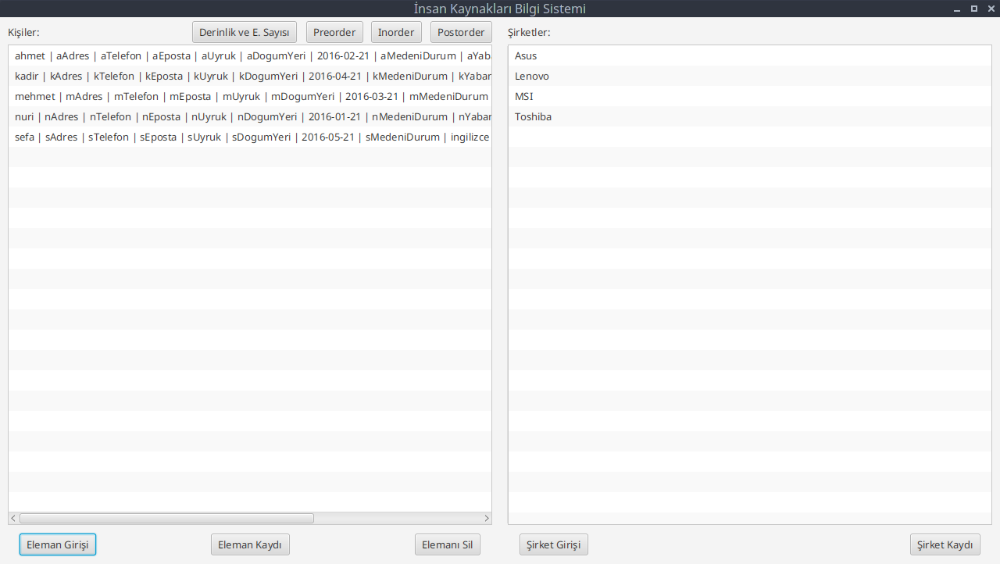
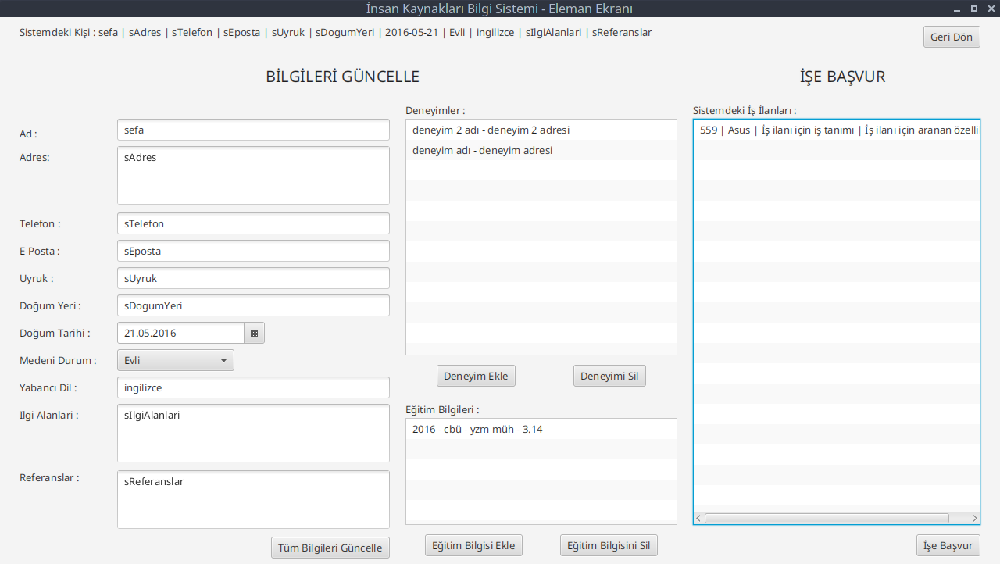
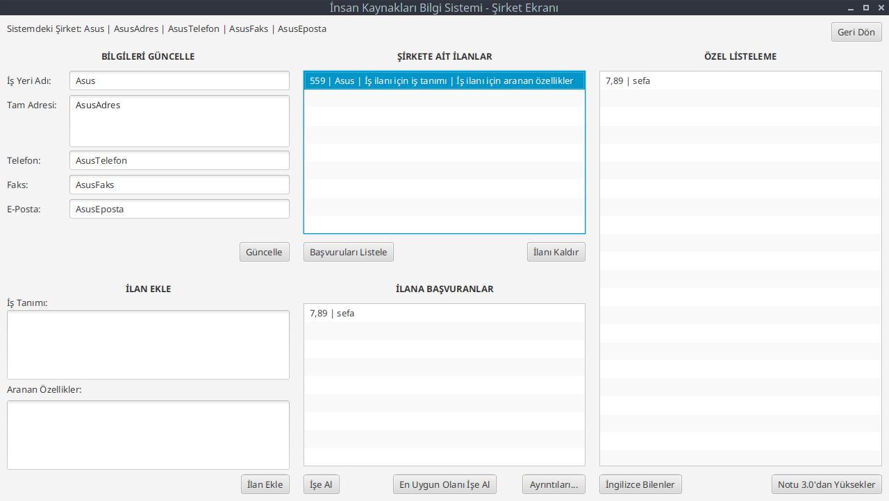

# YZM 2116 - Grup 8 - İnsan Kaynakları Bilgi Sistemi
----------------------------------------------------
Veri Yapıları dersi için Java, JavaFX kullanılarak geliştirilmiş İnsan Kaynakları Bilgi Sistemi dönem projesi.

Grup 8:  
[Nuri UZUNOĞLU](https://github.com/nuriu)  
[Kadir Sefa ÜNAL](https://github.com/kadirsefaunal)

# Karşılama Ekranı:

# Eleman Ekranı:

# Şirket Ekranı:

